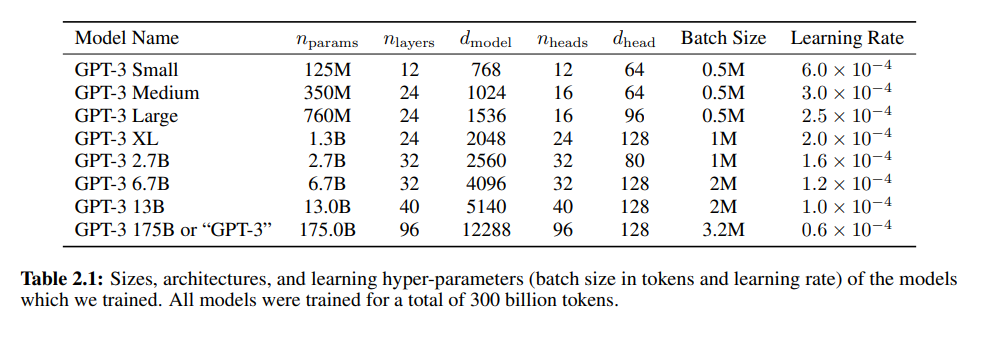

# [Language Models and Unsupervised Multitask Learners (GPT-2)](https://cdn.openai.com/better-language-models/language_models_are_unsupervised_multitask_learners.pdf)

- We delve into unspuervised datasets, basically just provide the dataset to the model, and then expect it to predict and learn the outputs for given inputs on its own.

[OpenAI's Page](https://openai.com/index/better-language-models/)

- GPT-2 is transformer based on 1.8B parameters and 8 million pages of data from the internet.
- Texts that occurs more frequnetly in data have a higher chance of reasonable text generation as compared to data whihc is techincal or rare, which perform poorly.
- Createed a new web scrape called WebText which collected data from all Reddit outbound links whihc had greater than 3 karma.
- Implemented Byte Pair Ecnoding (BPE), basically giving word-level inputs for more frequent symbol sequences and character-levle inputs for infrequent symbol sequences. Also, BPE was prevented from merging across character categories for any byte sequence, except spaces which improved compression efficiency while adding minimal fragmentation.
- Basically GPT-2 is trained based on WebText and the comparedto other corpuses to give a metric as to what is the performance of the language model.

- We see that PPL is perplexity (closer to one is better) and ACC is accuracy (higher the better.)
- We see that the model is prompted with text in some places to induce certain behavior. For example, in Summarization, the model uses `TL;DR:` to induce the summarization behavior.
- It also discusses generlization vs. memorization where some data tends to overlap in datasets, leading to the outputs being more biased towarsd them. This leads to memorization, whihc is not what we want.

# [Language Models are Few-Shot Learners (GPT-3)](https://arxiv.org/pdf/2005.14165)
- If a language model is trained on enough data, it can do tasks it has not been trained for, with ease.
- The paper dives into how different parameter size can affect the performance of the model. THey essentially created different models of GPT-3 with different parameter sizes and compared their performances.

- Most data models use fine-tuning after pre-training to train the language models, but GPT-3 skips the fine-tuning and uses a sort-of zero-shot approach with direct data to prompts.

- Zero-shot is the closest to how a human percieves instructions as a human would know what to do given only the task decription and prompt.
- You can easily make improvmeents in a language model by scaling up its inputs such as compute and parameters to decreas the validation loss.
- Thus the context consists of three things:
    1. The task description.
    2. Some amount of examples given (optional).
    3. The prompt.
- There is no basic reasoning happening, it is just looking at its training data and interpolating them with the context to provide an answer.
- In translation, difference in BLEU metric can be seen high when data is being translated from English to some other language, than when it is being converted to English,as most of the dataset is in English.
- **Supervised Training Set** - Has output labels for each input, meaning the output label is fed to the model beforehand. $\\$
**Unsupervised Training Set** - The output data has no lables, so just the input os given, and the machine has to look at patterns and clusters to recognise otuput labels.
- Winograd tasks aim at finding which word a pronoun refers to, when the pronound is gramatically ambiguous but semantically unambiguous to a human.

# [Training language models to follow instructions with human feedback (InstructGPT)](https://arxiv.org/pdf/2203.02155)

- The authors bsically propose a way of reducing untruthful, toxic and unhelpful answers from GPT-3 by using human feedback to align them with the users.
- They propose a two-phase training process:
    1. **Supervised Fine Tuning (SFT):**
        - Collected a dataset of prompts paired with ideal responses crafted by human labelers.
        - Fine-tuned GPT-3 on this dataset to teach the model to follow instructions more accurately.
    2. **Reinforcement Learning from Human Feedback (RLHF):**
        - Generated multiple responses for a given prompt using the SFT model.
        - Human labelers ranked these responses based on quality.
        - Trained a reward model on these rankings.
        - Further fine-tuned the SFT model using Proximal Policy Optimization (PPO), guided by the reward model.

- It was noticed that the 1.3B InstructGPT model was preferred over the 175B GPT-3 model by humans in terms of prompts, with reduction in toxicity and untruthfulness, while having minimal performance regressions on the public NLP datasets.

- The labellers based their data on the following metrics:

## Reward Mechanisms

In reinforcement learning, a reward mechanism is designed to provide feedback to the learning agent about how good its actions are in a given state. This feedback is in the form of a numerical reward, which the agent aims to maximize over time. The reward mechanism is crucial as it directly influences the learning process and the strategy that the agent develops.

### Reward Formula

A common formula used to calculate the reward in reinforcement learning is:

$$ R_t = r(s_t, a_t) + \gamma \cdot V(s_{t+1}) $$

where:
- $R_t$ is the reward at time step $t$.
- $r(s_t, a_t)$ is the immediate reward received after taking action $a_t$ in state $s_t$.
- $\gamma$ is the discount factor, which determines the importance of future rewards. A value of 0 makes the agent only consider immediate rewards, while a value close to 1 will make it strive for long-term rewards.
- $V(s_{t+1})$ is the estimated value of the next state $s_{t+1}$.

### Explanation of the Formula

- **Immediate Reward $r(s_t, a_t)$:** This is the direct reward the agent receives from the environment after performing an action. It provides immediate feedback on the action's outcome.
  
- **Discount Factor $\gamma$:** This factor balances the importance of immediate versus future rewards. A higher value of $\gamma$ means that the agent values future rewards more highly, encouraging long-term strategy development.

- **Value of Next State $V(s_{t+1})$:** This represents the expected reward of the next state, providing a way for the agent to consider the potential future benefits of its current actions.

The overall goal is for the agent to learn a policy that maximizes the cumulative reward over time, taking both immediate and future rewards into account.

### Adam Optimizer

The Adam optimizer is a popular algorithm for optimizing the parameters of the reward model in the InstructGPT architecture. It is based on the stochastic gradient descent algorithm and is an extension to RMSProp. The Adam optimizer is known for its ability to handle sparse gradients and to converge quickly to a minimum. The update rule is as follows:

$$ m_t \leftarrow \beta_1 \cdot m_{t-1} + (1-\beta_1) \cdot g_t $$
$$ v_t \leftarrow \beta_2 \cdot v_{t-1} + (1-\beta_2) \cdot g_t^2 $$
$$ \Delta \theta \leftarrow - \frac{\alpha \cdot m_t}{\sqrt{v_t} + \epsilon} $$

where:
- $m_t$ is the first moment estimate at time step $t$.
- $v_t$ is the second moment estimate at time step $t$.
- $g_t$ is the gradient of the loss at time step $t$.
- $\beta_1$ and $\beta_2$ are the decay rates for the first and second moment estimates.
- $\alpha$ is the learning rate.
- $\epsilon$ is a small constant for numerical stability.

### Formula with Adam Optimizer

The formula for calculating the cumulative reward in the InstructGPT architecture using the Adam optimizer is as follows:

$$ R_t = \frac{\alpha \cdot m_t}{\sqrt{v_t} + \epsilon} \cdot (r(s_t, a_t) + \gamma \cdot V(s_{t+1})) $$

where:
- $R_t$ is the cumulative reward at time step $t$.
- $m_t$ is the first moment estimate at time step $t$.
- $v_t$ is the second moment estimate at time step $t$.
- $r(s_t, a_t)$ is the immediate reward received after taking action $a_t$ in state $s_t$.
- $\gamma$ is the discount factor.
- $V(s_{t+1})$ is the estimated value of the next state $s_{t+1}$.

### Proximal Policy Optimization (PPO)

Proximal Policy Optimization (PPO) is a family of model-free, on-policy, and online reinforcement learning algorithms. It is used in the InstructGPT architecture to optimize the policy directly. The general idea is to learn a policy that is close to the current policy. The update rule is as follows:

$$ \theta \leftarrow \theta + \alpha \cdot \frac{\pi_\theta(a|s)}{\pi_{\theta_\text{old}}(a|s)} \cdot A(s, a) $$

where:
- $\theta$ is the policy parameter.
- $\theta_\text{old}$ is the policy parameter of the old policy.
- $A(s, a)$ is the advantage function.
- $\pi_\theta(a|s)$ is the probability of taking action $a$ in state $s$ under policy $\theta$.
- $\alpha$ is the learning rate.

The advantage function is used to determine whether the action taken is good or bad. If the advantage function is positive, then the policy should be updated to increase the probability of taking the action. If the advantage function is negative, then the policy should be updated to decrease the probability of taking the action.

The advantage function is calculated as follows:

$$ A(s, a) = Q(s, a) - V(s) $$

where:

- $Q(s, a)$ is the expected return when taking action $a$ in state $s$.
- $V(s)$ is the expected return when taking the best action in state $s$ according to the current policy.

The advantage function is used to determine whether the action taken is good or bad. If the advantage function is positive, then the policy should be updated to increase the probability of taking the action. If the advantage function is negative, then the policy should be updated to decrease the probability of taking the action.
 