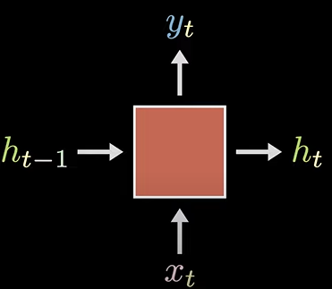

# Natural Language Processing

This consists of problems such as:
 1. **Language Modelling** - Machine Translation, Text Summarization, Question Answering
 2. **Grounding** - Text-to-image
 3. **Speech** - Text-to-speech (TTS), Automatic Speech Recognition (ASR)

## N-gram Model

- Let $P_\theta$ be the **language model** with some context window $k$. Then, $P_\theta$ gives me the probability distribution across all words, given the past $k$ words.
- For example, if feed in autocomplete "the sky is...", then if I want the answer to be blue:
$$ P[\text{\blue{blue}} \ | \ \text{the sky is}] = \frac{C(\text{the sky is \blue{blue}})}{C(\text{the sky is})}$$
- This has to be done through training of the model along some datasets, which have the exact same condition where the line "the sky is" comes before the word "blue".
- This is called the N-gram model, which derives context from the previous N words of the prompt. For a context window size of two, you examine three words at a time. This gives you the triagram model:
$$ P[\blue{w_i} \ | \ w_{i-1}w_{i-2}w_{i-3}] \approx \frac{C(w_{i-2}w_{i-1}\blue{w_{i}})}{C(w_{i-2}w_{i-1})} $$
- We can also apply some smoothing function to make sure that the denominator is never 0.
$$ P[\blue{w_i} \ | \ w_{i-1}w_{i-2}w_{i-3}] \approx \frac{C(w_{i-2}w_{i-1}\blue{w_{i}}) + 1}{C(w_{i-2}w_{i-1}) + \red{|V|}} $$
- This relation between the word and its previous context are called **long-form dependencies**.
---

- Any output of a neural network can be given by:
$$ \hat y = H(\mathbf{\vec{W}x + b}) $$
where $\mathbf{\vec{W}} \rightarrow$ weight matrix $\\$
$\mathbf{x} \rightarrow$ input vector $\\$
$\mathbf{b} \rightarrow$ bias vector $\\$
$H(\cdot) \rightarrow$ any non-linear function

## Recurrent Neural Networks
- Sentences follow an order, and the meaning of a sentence depends on this order of the words. This is called **recurrence**. Recurrent neural networks have loops, that act as a storagr for context.
- Start by creating an Recurrent Neural Network (RNN) cell, say of index $t$, with an input $\blue{x}_t$ and output $\pink{y}_t$ and some hidden state, $\textcolor{yellow}{h}_t$ which encodes the representatoins of the text thus far.
- The hidden state $\textcolor{yellow}{h}_{t-1}$ is carried from the previous cell, updated with the input $\blue{x}_t$ and then carried to the next cell as $\textcolor{yellow}{h}_t$. We then examine the outou $\pink{y}_t$ of the last cell.
$$ \textcolor{yellow}{h}_t = \textcolor{cyan}{\sigma}(W\textcolor{yellow}{h}_{t-1} + V\blue{x}_t + \green{b}_h) $$
$$ \pink{y}_t = \textcolor{cyan}{\sigma}(U\textcolor{yellow}{h}_{t} + \green{b}_y) $$
where $\textcolor{cyan}{\sigma}$ is a non-linear activation function.
- Thus for each cell, $\pink{y}_t$ will give the probability distribution for the next word based on the previous words.
- There is no fixed length for inputs, you can feed in as many words as you want. $\\$

- The matrices used to do these transformations are the same across all cells. This helps preserve context of the word, no matter the position.
- But this, required a lot of serial computations, with no room for parallel processing, along with the failure to capture long-term dependencies.
- This is because if I want to update the probability of the word I want to increase, I will need to make sure the context before that is the exact I want, meaning I need to update the hidden state.
- For this, I need to update the hiden states before that, and keep doing so. This might result in the actual probability I want getting lost in the contexts, leading to something called the **vanishing gradient**.
- To overcome this we use something called a long short-term memory cell (LSTM), which also has a long-term memory with the existing short-term memory.
- Machine translation use two kinds of RNNs - encoder and decoder. The last cell of the encoder acts as the bottleneck as it must hold the entire context of the previous cells in its context, as this is the only source for the decoders.
- The relation between the encoder and decoder's hidden states gives us the attention of that output based on the given output. Thus,
$$ \mathbf{A} = s^T h_i $$
- This is then sent through a doftmax function to create probability distribution.
- Following this, we have the attention mechanism, which is present in [Deep Learning Notes](<Deep Learning Notes.md>). It basically gives the entire context of each of the encoder cells to each of the decoder cells.

